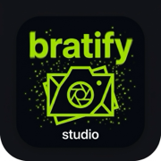

# 🟢 Bratify — Viral Meme, Multi-Photo Frame & Collage Studio

<p align="center">
  
</p>

<p align="center">
  <b>Bratify</b> is an aesthetic meme creator, multi-photo collage maker, and creative frame studio built for iOS with Flutter. Inspired by the iconic lime-green album trend and Y2K internet culture, Bratify lets creators design viral text memes, compose photos into 500+ curated frames & collages, fine-tune imagery in a dedicated full-screen crop studio, apply authentic film grain and blur effects, and export ultra-sharp HD creations.
</p>

<p align="center">
  
  
  
  
  
  
</p>

---

## ✨ Key Features

### 🟢 1. Iconic Brat Meme Studio & Viral Quotes
* **Signature Aesthetic:** Authentic lime-green background (`#8ACE00`), low-res blur styling, and high-contrast typography.
* **Color Freedom:** Switch instantly between Classic Lime, Crisp White, Studio Dark Mode, or custom palette pickers.
* **120+ Viral Quotes Engine:** 10 curated categories (Brat Summer, Pop Culture, Relatable, Sassy, Minimalist, etc.). Tapping any quote instantly opens the creative editor and updates the canvas text and active frame caption.
* **Brat FX Suite:** 35mm film grain overlays, vintage camera blur, and subtle vignette adjustments for authentic 2000s internet aesthetics.

### 🖼️ 2. 500+ Curated Aesthetic Frames & Multi-Photo Collages
* **Dedicated Home Screen (`TemplatesScreen`):** Clean, searchable template gallery categorized into Polaroid & Vintage, Digicam ISO, Cyber Y2K, Music Players, Windows 98, and Collages.
* **Multi-Photo Layouts (1–4 Photos):** Full support for multi-photo frames (`split2H`, `split2V`, `polaroidDuo`, `triptych3`, `filmstrip3`, `grid4`) with individual photo placeholders and slot selectors.
* **Pre-Flight Guidance (`FramePreflightSheet`):** Interactive modal displaying required photo count, aspect ratios (1:1, 9:16, 4:5), and effects before entering the editor.

### ✂️ 3. Dedicated Full-Screen Image Crop & Adjust Studio (`ImageCropScreen`)
* **Expansive Workspace:** Clean full-screen editing interface away from canvas clutter.
* **Interactive Controls:** Smooth pinch-to-zoom, drag-to-pan, 90° clockwise rotation, and horizontal & vertical mirror flips.
* **Rule-of-Thirds Grid:** 3x3 alignment guide for precise photographic framing.
* **Social Aspect Ratio Presets:** 1-tap switching between `1:1 Square`, `4:5 Portrait`, `9:16 Story/Reel`, `16:9 Landscape`, and `3:4 Classic`.

### 🎨 4. Dedicated Post Editor (`GenerateScreen`)
* **Focused Workspace:** Dedicated header with `← Templates` back navigation, template name, aspect ratio badge, and top-bar Undo/Redo/Reset buttons.
* **Multi-Slot Photo Toolbar:** Quick-action pills to switch active photo slots, trigger full-screen crop, swap photo source, or clear slots.
* **Arranged Controls:** Clean separation of canvas, transform controls, typography options, and export actions.

### 🔤 5. Google Fonts Typography Studio
* **30+ Curated Fonts:** Display fonts, retro monospace, modern clean sans-serifs, and editorial serifs.
* **Granular Controls:** Letter spacing, line height, text shadows, alignment (left, center, right), and frame caption synchronization.

### 💾 6. Ultra-HD Export, Real-Time Library & iPad Share Safety
* **Native PhotoKit Saving:** Clean iOS Photos integration powered by `gal: ^2.3.1` (fully Swift Package Manager compatible).
* **Real-time Database Sync:** `DatabaseHelper.savedMemesChangeNotifier` instantly updates the saved drafts library (`SaveScreen`) when a new design is saved.
* **iPad Popover Crash-Proof:** Contextual `sharePositionOrigin` anchored to the Share button's `RenderBox` prevents `UIActivityViewController` presentation crashes on iPads.

### 🔒 7. 100% Private & Offline Architecture
* **Zero Tracking:** No advertising SDKs, no third-party tracking identifiers, and no analytics beacons.
* **Zero Cloud Uploads:** All rendering executes 100% locally on the device using Flutter's native Canvas engine.
* **Zero Account Friction:** Instant launch with no registration or subscriptions required.
* **In-App Privacy Policy:** Clear on-device declaration accessible via Settings > Privacy & Data Safety.

---

## 🏗️ Architecture & Project Structure

```text
brat_generator/
├── lib/
│   ├── config/              # App constants & App Store configuration (app_config.dart)
│   ├── constants/           # Color tokens, string constants, theme definitions
│   ├── features/
│   │   ├── frames/          # Frame pre-flight guidance sheet & requirements checklist
│   │   ├── photo_transform/ # PhotoTransformState & per-slot transform logic
│   │   └── studio_effects/  # Film grain, blur, and vintage vignette controls
│   ├── models/              # Frame template, text layer & meme design data models
│   ├── screens/
│   │   ├── generate_screen.dart    # Dedicated studio canvas, slot controls & editor
│   │   ├── home_screen.dart        # Clean Studio Hub & DIY frame layout starters
│   │   ├── image_crop_screen.dart  # Dedicated full-screen image crop & adjust studio
│   │   ├── main_screen.dart        # Root bottom navigation controller
│   │   ├── maintenance_screen.dart # Graceful error boundary fallback screen
│   │   ├── onboarding_screen.dart  # Lightweight vector custom-painted introduction
│   │   ├── process_screen.dart     # Modern export & processing overlay modal
│   │   ├── save_screen.dart        # Real-time reactive drafts library with iPad-safe share
│   │   ├── splash_screen.dart      # iOS-style startup sequence with diagnostic log
│   │   └── settings/               # FAQs, in-app privacy policy modal & rating deep-link
│   ├── services/
│   │   ├── app_update_service.dart # Store version check using Universal HTTPS links
│   │   ├── database_service.dart   # SQLite database operations with change notifier
│   │   └── logger_service.dart     # Diagnostic logging & error boundary
│   ├── widgets/
│   │   ├── frame_canvas_widget.dart# Multi-photo slot layout renderer (1–4 photos)
│   │   ├── interactive_text_overlay.dart # Draggable, resizable canvas text layers
│   │   └── text_layers_manager_widget.dart # Text layers bottom sheet manager
│   └── my_app.dart                 # MaterialApp root, theme, and system overlays
├── ios/
│   ├── Runner/
│   │   ├── Assets.xcassets/ # Option 2 (Dark Studio) AppIcon (1024 down to 20px)
│   │   ├── Base.lproj/      # Dark LaunchScreen.storyboard (zero white flash)
│   │   └── Info.plist       # Purpose-driven permission strings & dynamic versioning
│   ├── Podfile              # iOS 15.0 deployment target & modular headers
│   └── Runner.xcodeproj/    # Configured with bundle ID `com.manav.bratify`
├── test/
│   ├── frame_preflight_test.dart       # Preflight modal requirements & checklist tests
│   ├── mainscreen_test.dart            # Multi-screen capture & layout regression suite
│   ├── multi_photo_and_crop_test.dart  # Multi-photo layouts, crop studio & sync tests
│   └── widget_test.dart                # Splash boot sequence test
├── app_info.md              # App Store Connect metadata, keywords & reviewer notes
├── ios_issues.md            # App Store review audit report & resolved issues archive
└── pubspec.yaml             # Lean dependency manifest (zero bloat)
```

---

## 🚀 Getting Started

### Prerequisites
* **macOS** with Xcode 15+ installed
* **Flutter SDK:** `^3.12.2` (Channel stable)
* **CocoaPods:** `1.14+`

### Installation & Local Setup

1. **Clone the repository:**
   ```bash
   git clone <repo-url> brat_generator
   cd brat_generator
   ```

2. **Install Flutter dependencies:**
   ```bash
   flutter pub get
   ```

3. **Install iOS Pods:**
   ```bash
   cd ios
   pod install --repo-update
   cd ..
   ```

4. **Run on iOS Simulator or Connected Device:**
   ```bash
   flutter run -d iphone
   ```

---

## 🧪 Testing & Code Quality

Run tests and analysis to ensure high code quality:

```bash
# Run static analysis (0 warnings, 0 errors)
flutter analyze

# Run all 20 automated unit and widget tests
flutter test
```

---

## 📦 Building for Production (App Store Release)

1. **Clean and Prepare:**
   ```bash
   flutter clean
   flutter pub get
   ```

2. **Build iOS Archive (IPA):**
   ```bash
   flutter build ipa --release
   ```

3. **Distribute via Xcode Organizer:**
   * Open the generated Xcode archive in `build/ios/archive/Runner.xcarchive`.
   * Click **Distribute App** -> **App Store Connect** -> **Upload**.

---

## 📋 App Store Review Guidelines Compliance

| Guideline | Requirement | How Bratify Complies |
| :--- | :--- | :--- |
| **5.1.1 (Privacy)** | Purpose-driven permission strings & data safety | `Info.plist` includes user-facing descriptions for Camera & Photo Library. 100% on-device processing. In-app privacy sheet accessible in Settings. |
| **4.2 (Minimum Functionality)** | Rich, differentiated user experience | 500+ aesthetic frames, multi-photo collages (1–4 photos), full-screen crop studio, 120+ viral quotes, 30+ Google fonts, Brat FX, and reactive drafts library. |
| **5.6.1 (Customer Reviews)** | No forced or unearned rating dialogs | No first-launch rating popups. Ratings are 100% user-initiated from Settings using direct App Store deep-link. |
| **2.1 (App Completeness)** | Stable, crash-free execution | Tested on iPad & iPhone with bounds checks, button-anchored iPad share sheet popovers, and error boundaries. |

---

## 📄 Documentation References
* [app_info.md](file:///Users/manavramani/Documents/ios_apps/pending/brat_generator/app_info.md): Complete App Store Connect metadata, 100-character keyword strings, promotional text, and Apple Reviewer Notes.
* [ios_issues.md](file:///Users/manavramani/Documents/ios_apps/pending/brat_generator/ios_issues.md): App Store review audit report, pre-submission checklist, and resolution changelog.

---

## ⚖️ License & Disclaimer
Bratify is an independent creative photo editing application. All meme templates, filters, and fonts are generated locally for creative expression.
