# 🟢 Bratify — Aesthetic Viral Meme Studio & Multi-Photo Frame Maker

  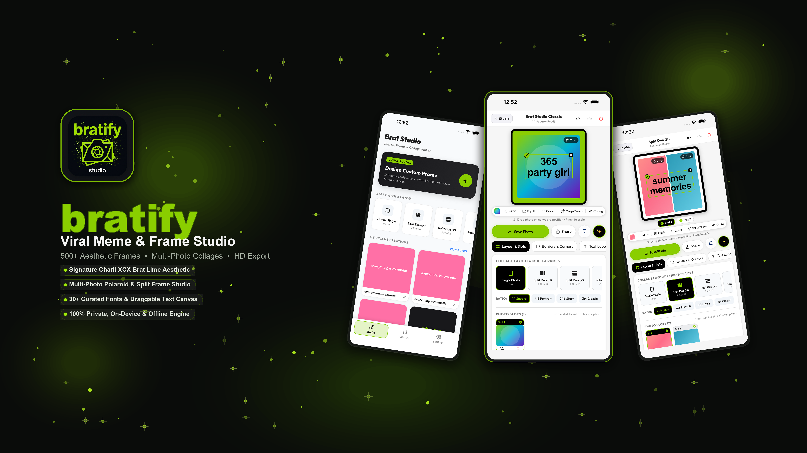

  <b>Bratify</b> is the premier iOS creative suite for iconic text memes, multi-photo aesthetic collages, and nostalgic Y2K frame art. Inspired by the signature lime-green cultural wave, Bratify combines a high-performance on-device editing engine with 500+ curated frames, dynamic multi-photo layouts (1 to 4 photos), 30+ Google fonts, 12 film color-grading filters, and full-screen precision cropping.

  
  
  
  
  
  
  
  

---

## 📱 iPhone Studio Experience (6.1" – 6.7" Super Retina XDR)

> 💡 **Horizontal Scroll:** Swipe or scroll horizontally across the table below to analyze all 5 iPhone core screens in sequence.

| 01. Studio Hub & Templates | 02. Real-Time Canvas Editor | 03. Multi-Photo Collages | 04. Crop & Adjust Studio | 05. Saved Drafts Library |
| :---: | :---: | :---: | :---: | :---: |
| 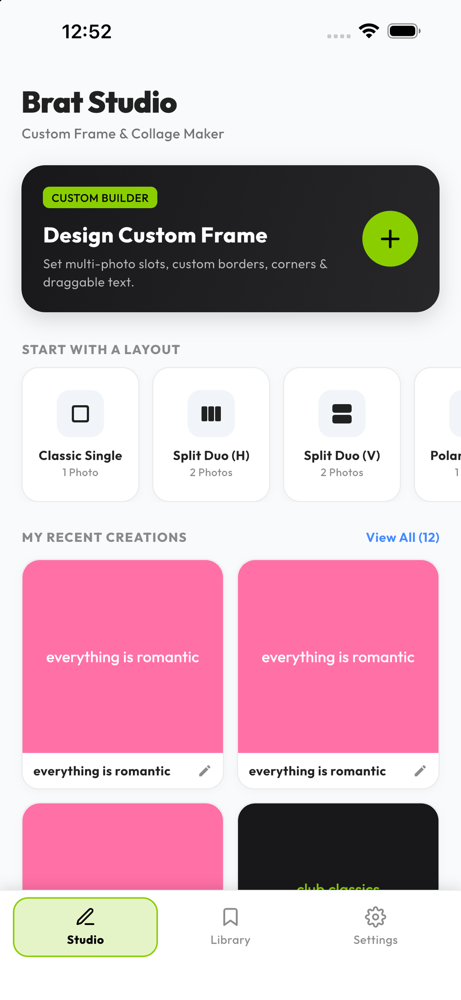 | 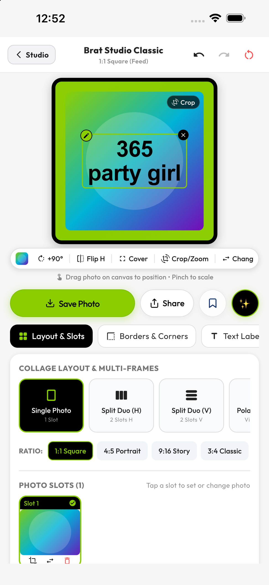 | 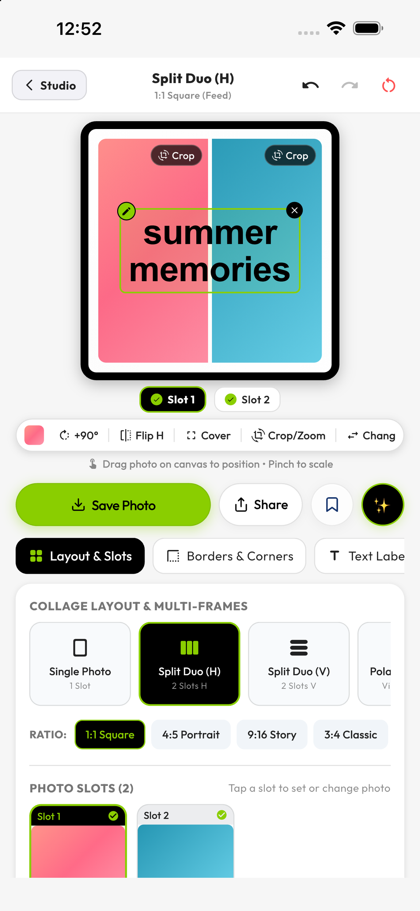 | 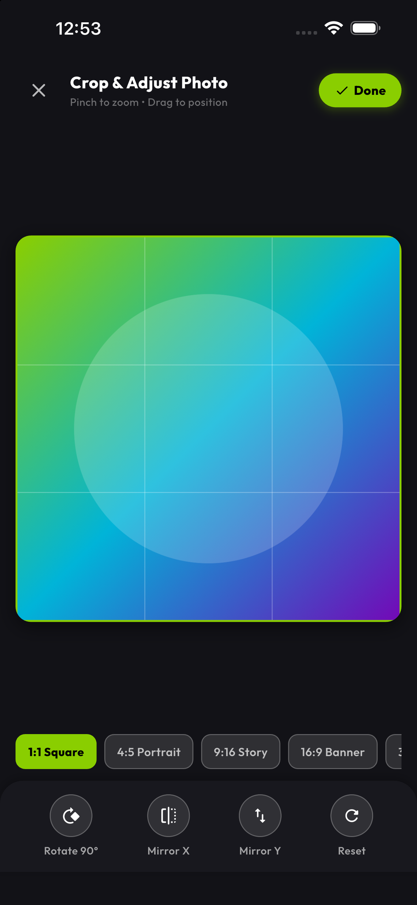 | 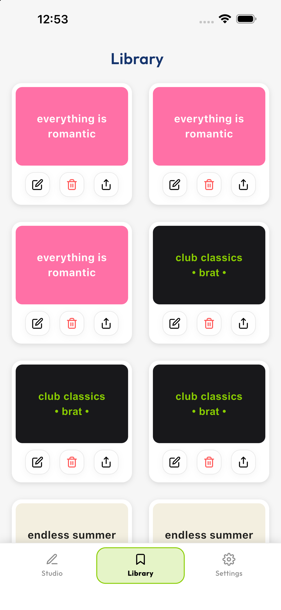 |
| **500+ Frames & 120+ Quotes** | **Typography & Live Blur** | **1–4 Photos Multi-Slot** | **Pinch-Zoom, Tilt & Mirror** | **Lossless Drafts Re-Editing** |

### 🔍 iPhone Screen-by-Screen Detailed Analysis:

* **Screen 01 (Studio Hub & Templates):**
  * **Branding & Visuals:** Deep carbon studio backdrop (`#121212`) contrasted with authentic Brat Lime (`#8ACE00`).
  * **120+ Viral Quotes Engine:** Horizontally scrollable quote chips categorized into 10 themes (*Brat Summer, Pop Culture, Relatable, Sassy, Minimalist, etc.*). Tapping any quote instantly opens the editor with text synchronized to canvas layers.
  * **Curated Template Cards:** High-density 2-column grid showcasing Polaroid, Digicam ISO, Cyber Y2K, Music Players, and Collage starters.
  * **Pre-Flight Badges:** Clear visual indicators displaying required photo counts and aspect ratios (1:1, 4:5, 9:16).
  * **Floating Glass Dock:** Frosted glass bottom bar with haptic feedback connecting Studio, Editor, Saved Library, and Settings.

* **Screen 02 (Real-Time Canvas Editor):**
  * **Live Interactive Canvas:** 60fps real-time compositing rendering crisp text against the signature lime backdrop.
  * **Draggable Multi-Text Overlays:** Free touch drag-and-drop text positioning with normalized relative coordinate persistence.
  * **Typography Controls:** 30+ Google fonts, font size slider, font weight pills, and authentic low-res text blur slider.
  * **Dual Background Engine:** 1-tap toggle between solid colors/gradients and custom photo backdrops with opacity and blur controls.
  * **Layer Manager & History:** Dedicated bottom sheet to manage, duplicate, or reorder text layers, backed by full Undo/Redo.

* **Screen 03 (Multi-Photo Collages & Frame Customizer):**
  * **Dynamic Multi-Slot Layouts:** Full native support for 1 to 4 photos (`single`, `split2H`, `split2V`, `polaroidDuo`, `triptych3`, `filmstrip3`, `grid4`).
  * **Dedicated Slot Toolbar:** Interactive pills (`Slot 1`, `Slot 2`, etc.) allowing creators to pick, crop, or clear individual slots independently.
  * **Non-Destructive Frame Switching:** Seamlessly switch between collage layouts without losing loaded images or custom typography.
  * **Granular Border Customization:** Real-time sliders for border thickness, custom border colors, corner radius, and slot spacing.

* **Screen 04 (Dedicated Full-Screen Crop & Adjust Studio):**
  * **Distraction-Free Workspace:** Full-screen modal workspace isolated from canvas clutter for maximum precision.
  * **Fluid Multi-Touch Gestures:** Smooth pinch-to-zoom and drag-to-pan positioning to frame photos accurately.
  * **Precision Transform Controls:** 90° clockwise rotation button, fine `-45°` to `+45°` tilt angle slider, and horizontal/vertical mirror tools.
  * **Rule-of-Thirds Grid:** 3x3 alignment guide overlay for balanced composition.
  * **1-Tap Social Presets:** Instant aspect ratio switching: `1:1 Square`, `4:5 Portrait`, `9:16 Story/Reel`, `16:9 Landscape`, and `3:4 Classic`.

* **Screen 05 (Saved Drafts Library & Lossless Re-Editing):**
  * **SQLite On-Device Archive:** Responsive grid displaying all user creations with instant reactive updates upon saving.
  * **Zero-Loss 1-Tap Re-Editing:** Reopening any draft restores every slot image, background wallpaper, text layer position, filter, and transform.
  * **Ultra-HD Direct Export:** Renders high-fidelity 3x Retina PNG files directly to Apple Photos with zero compression and zero watermarks.
  * **iPad Popover Crash-Safe Sharing:** Contextually anchored sharing sheet ensuring smooth sharing on iPhones and iPads.

---

## 🖥️ iPad Pro Studio Experience (13" Liquid Retina XDR)

> 💡 **Horizontal Scroll:** Swipe or scroll horizontally across the table below to analyze all 5 iPad Pro tablet screens in sequence.

| 01. Studio Hub & Templates | 02. Real-Time Canvas Editor | 03. Multi-Photo Collages | 04. Crop & Adjust Studio | 05. Saved Drafts Library |
| :---: | :---: | :---: | :---: | :---: |
| 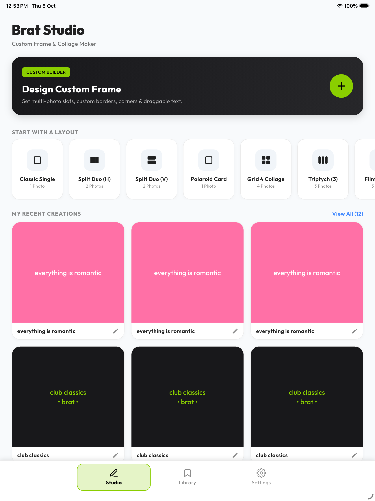 | 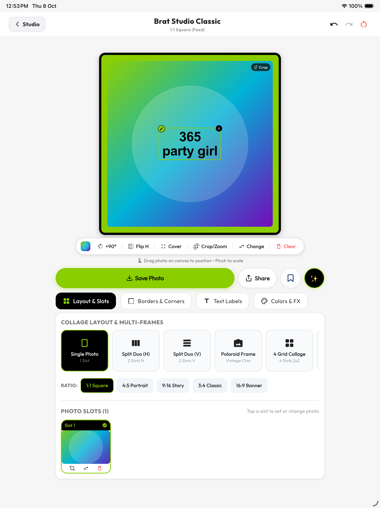 | 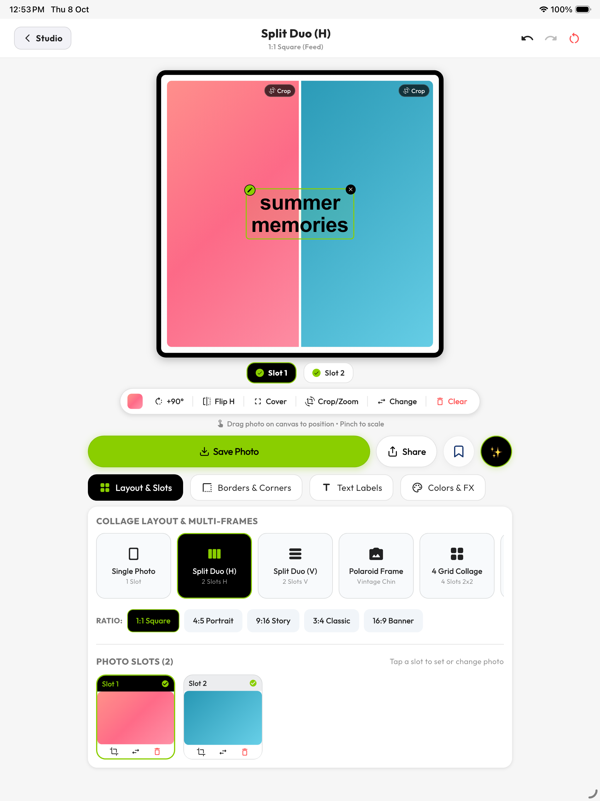 | 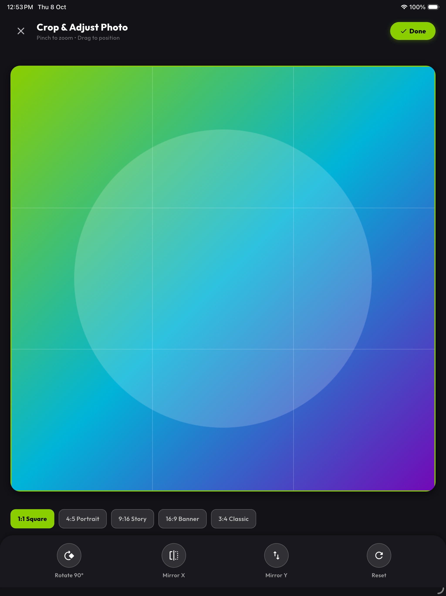 | 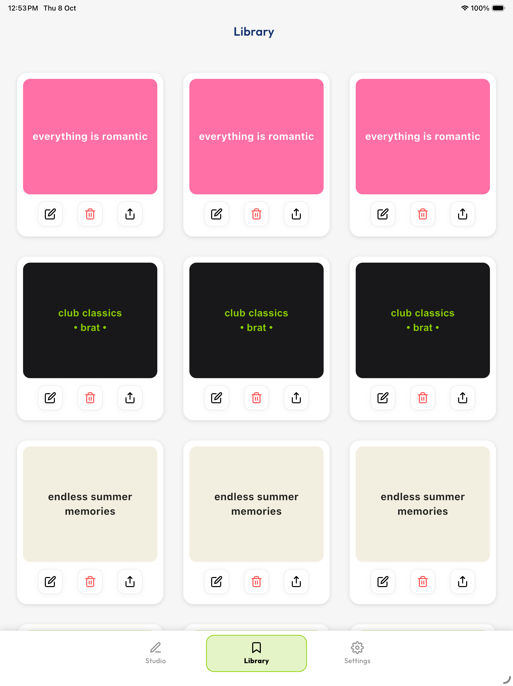 |
| **Expansive 3-Column Hub** | **Large Canvas & Bottom Dock** | **Tablet Multi-Slot Collages** | **Spacious Crop Studio** | **Responsive Drafts Grid** |

### 🔍 iPad Tablet UI & Screen Capabilities:

* **Expansive 3-Column Studio Hub:** Leverages the 13" Liquid Retina display to present template categories, viral quote pills, and frame previews in an expansive 3-column layout.
* **Large Preview Canvas (Up to 640pt width):** The creative editing canvas dynamically scales for tablet screens with centered constraints (up to 780pt) preventing awkward stretching.
* **Responsive Floating Navigation Dock:** Centered glass navigation bar constrained to a maximum width of 660pt with 26pt icons and 14pt typography.
* **Large Workspace Image Crop Studio:** The full-screen crop studio takes full advantage of the high-resolution tablet viewport for fine image panning, tilt adjustments, and composition alignment.
* **Popover-Anchored Native Sharing:** Sharing actions anchor directly to the Share button's `RenderBox`, completely preventing `UIActivityViewController` presentation crashes on iPadOS.

---

## 📱 iPhone Duo Aesthetic Showcase

> 💡 **Horizontal Scroll:** Supplementary showcase capturing iPhone Duo presentation layouts.

| 01. Studio Hub | 02. Canvas Studio | 03. Multi-Photo Collages | 04. Crop Studio | 05. Saved Library |
| :---: | :---: | :---: | :---: | :---: |
| 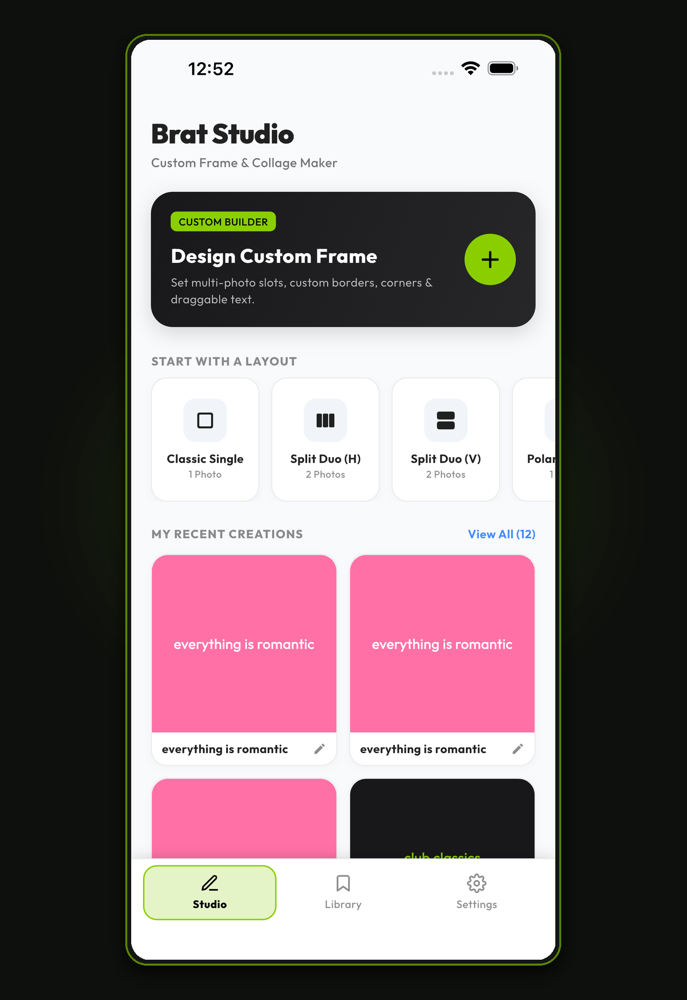 | 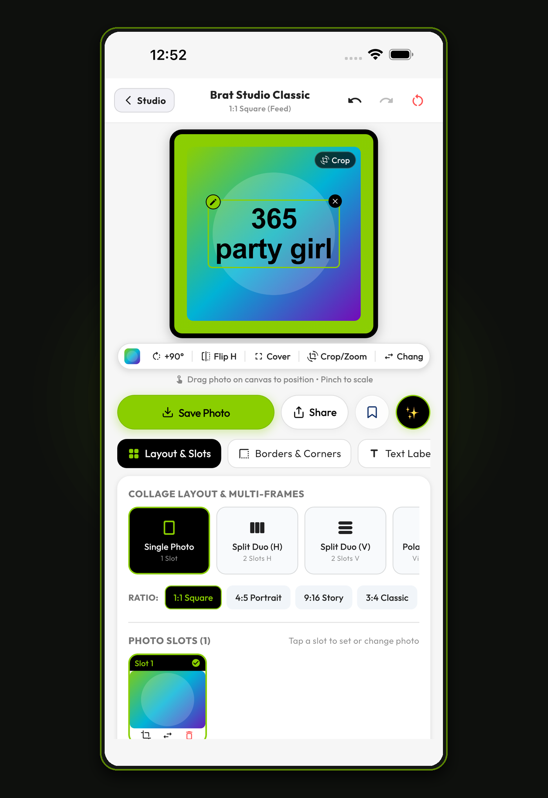 | 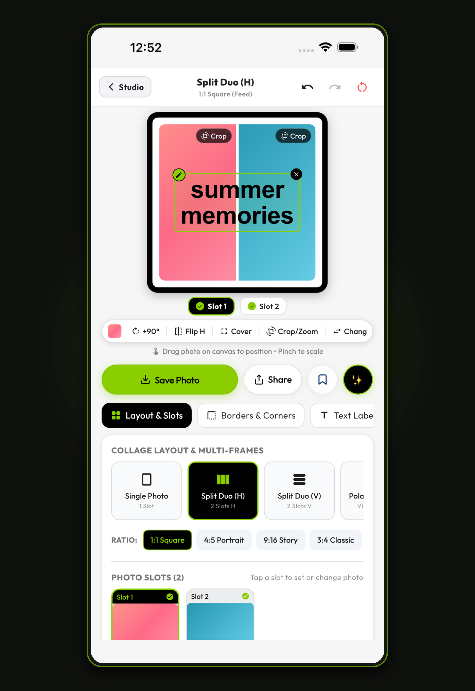 | 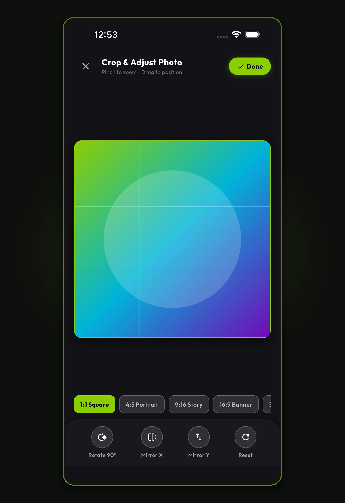 | 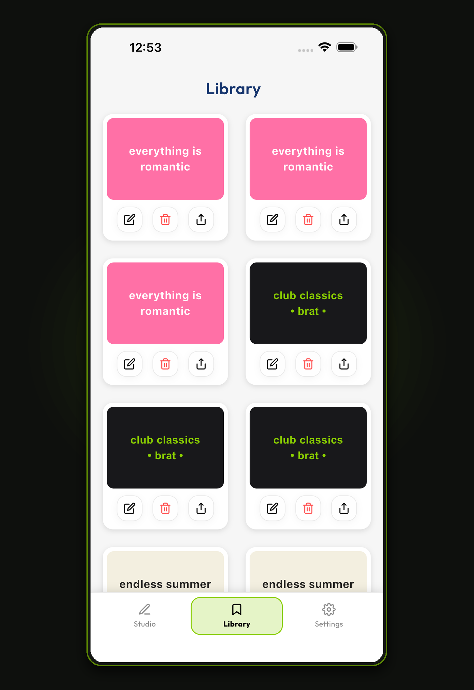 |
| **Aesthetic Starters** | **Live Typography** | **Multi-Slot Grids** | **Precision Framing** | **Drafts Archive** |

---

## 🎨 Curated Store Assets & Search Presentation

Bratify includes official Apple App Store Connect marketing assets designed for maximum search conversion and visual appeal:

### 🌟 App Store Search Results Banner

  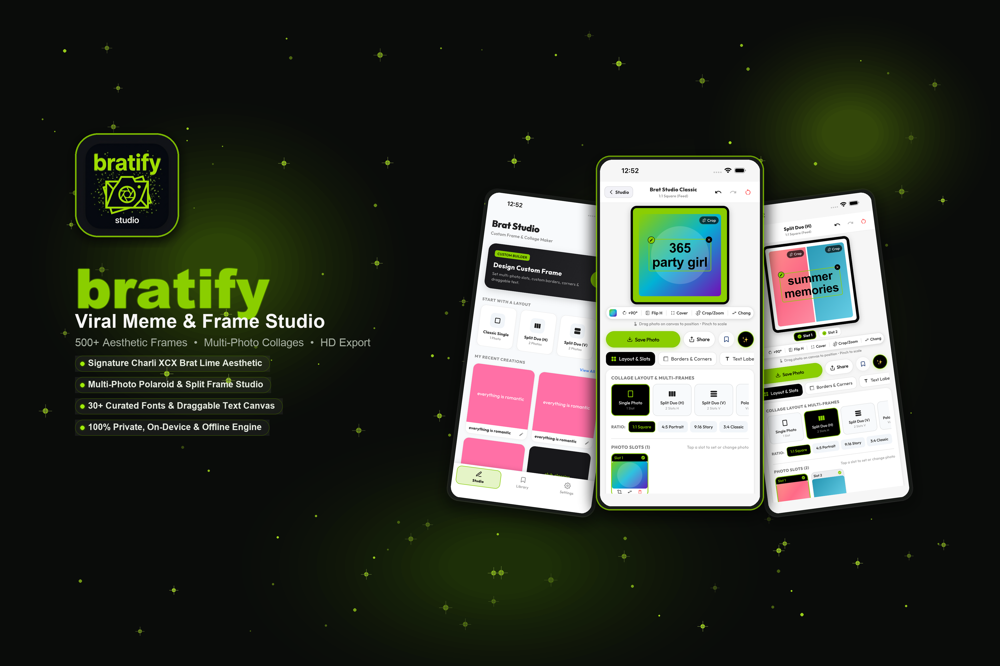

<i>Official 3840 x 2560 px (3:2) Search Results Showcase artwork highlighting core app capabilities.</i>

---

## 🌟 Complete App Features & Capabilities

### 🟢 1. Iconic Brat Meme Studio & 120+ Quotes Engine
* **Signature Aesthetic:** Authentic lime-green background (`#8ACE00`), low-res blur styling, and high-contrast typography.
* **Instant Palette Switching:** Seamlessly toggle between Classic Brat Lime, Crisp Minimalist White, Dark Carbon Studio (`#121212`), or fine-tune custom colors with the RGB palette picker.
* **120+ Viral Quotes Engine:** 10 curated categories (*Brat Summer, Pop Culture, Relatable, Sassy, Minimalist, Nightlife, Self-Care, Irony, Energy, Party*).
* **1-Tap Creative Sync:** Selecting any quote automatically opens the studio editor and syncs canvas text overlays and frame captions in real time.

---

### 🖼️ 2. 500+ Aesthetic Frames & Multi-Photo Collages (1–4 Photos)
* **Dynamic Multi-Photo Layouts:** Single photo, Split 2H, Split 2V, Polaroid Duo, Triptych 3, Filmstrip 3, and 2x2 Grid 4.
* **Per-Slot Photo Control Toolbar:** Dedicated slot selector pills (`Slot 1`, `Slot 2`, etc.), allowing independent photo replacement, clear slot, and per-slot crop adjustments.
* **Non-Destructive Switching:** Switch frame layouts without losing loaded slot images or custom text styling.
* **Granular Frame Customization:** Adjustable border width, customizable border color, corner radius sliders, and inner slot spacing.

---

### 🌄 3. Dual Background Engine (Solid Color vs. Custom Wallpaper)
* **Dual Background Modes:** Toggle seamlessly between **Solid Color / Gradient** and **Custom Canvas Background Image**.
* **Custom Wallpaper Import:** Bring in custom photos, textured backdrops, or aesthetic wallpapers directly from your Photo Library or Camera.
* **Background Opacity Slider:** Fine-tune backdrop transparency from `0%` to `100%` for subtle watermarks or high-impact contrast.
* **Background Gaussian Blur:** Smooth slider to create creamy bokeh backdrops behind photo frames and text layers.
* **Flexible BoxFit Options:** Switch effortlessly between `Cover`, `Contain`, and `Fill` display modes.
* **1-Tap Reset:** Instantly revert back to signature Brat Lime at any time with a single tap.

---

### 🔤 4. Unconstrained Typography & Multi-Text Drag Engine
* **Free Drag-and-Drop Positioning:** Place text anywhere on the canvas with smooth gesture drag-and-drop and normalized relative coordinate persistence.
* **Multi-Text Layers Manager:** Add unlimited text layers, edit captions, duplicate layers, reorder, or delete layers in a dedicated bottom sheet.
* **30+ Curated Google Fonts:** Bold display fonts, retro monospace, clean sans-serifs, handwritten scripts, and editorial serifs.
* **Full Typography Controls:** Font size slider, font weight, letter spacing, line height, text blur slider, text alignment, casing, colors, and drop shadows.

---

### 🎨 5. 12 Curated Aesthetic Color-Grading Filters
1. **Normal:** Crisp, natural, unaltered tone.
2. **🍏 Brat Lime (`brat`):** High-key neon lime matrix tone inspired by the album.
3. **🎬 Noir B&W (`noir`):** Deep high-contrast monochrome silver gelatin film.
4. **📷 Vintage 90s (`vintage`):** Warm nostalgic 90s disposable camera & Polaroid tone.
5. **⚡ Cyber Neon (`cyberpunk`):** Electric cyan and vivid magenta duotone.
6. **🌅 Golden Hour (`golden`):** Sun-drenched amber glow with warm skin tones.
7. **❄️ Cold Indie (`cold`):** Atmospheric twilight chill with moody blue shadows.
8. **💥 Vivid Pop (`vivid`):** Ultra-saturated punchy festival colors.
9. **☕ Warm Sepia (`sepia`):** Antique brown parchment authentic sepia tone.
10. **🧪 Acid Rave (`acid`):** High-energy fluorescent ultraviolet psychedelic vibe.
11. **🌸 Pastel Dream (`pastel`):** Soft dreamy bubblegum pink & lavender fairy aesthetic.
12. **🎞️ Teal & Orange (`cinematic`):** Rich Hollywood blockbuster contrast.
13. **🩻 Invert X-Ray (`invert`):** Striking negative spectrum inverted exposure.
* **Hardware-Accelerated Blending:** Real-time filter intensity slider (`0%` to `100%`) calculated via 4x5 ColorFilter matrix interpolation against the Identity matrix.

---

### ✨ 6. Authentic Studio FX Suite
* **Authentic Low-Res Blur:** Adjustable `blurSigma` slider to recreate signature blurred text and album vibes.
* **35mm Film Grain:** Realistic film noise overlay slider for vintage analog camera texture.
* **Vignette Tool:** Soft radial edge shadowing to focus attention on your subject.
* **Color Inversion:** 1-tap instant color inversion for edgy high-fashion aesthetics.

---

### ✂️ 7. Dedicated Full-Screen Image Crop & Adjust Studio
* **Expansive Workspace:** Clean, full-screen editing interface separated from canvas clutter.
* **Fluid Multi-Touch Gestures:** Smooth pinch-to-zoom and drag-to-pan positioning.
* **Precision Transform Controls:** 90° clockwise rotation, custom tilt angle slider (`-45°` to `+45°`), horizontal/vertical mirror tools, and Rule-of-Thirds 3x3 alignment grid.
* **Social Aspect Ratio Presets:** 1-tap switching between `1:1 Square`, `4:5 Portrait`, `9:16 Story/Reel`, `16:9 Landscape`, and `3:4 Classic`.

---

### ↩️ 8. Unlimited Undo & Redo History System
* Full step-by-step history tracking stack allowing creators to step backward and forward across all creative adjustments (canvas background changes, text edits, filter toggles, effect sliders) with complete confidence.

---

### 💾 9. Real-Time Library & Lossless Drafts Re-Editing
* **On-Device SQLite Storage:** Automatic local persistence of all designs without loss of fidelity.
* **Zero-Loss Re-Editing:** Tapping any saved creation in the Library reloads all design elements (slot photos, background photo, text coordinates, active filter, transforms).
* **Real-Time Reactive Updates:** Newly saved designs appear immediately in the library without manual refreshes.

---

### 📸 10. Ultra-HD Crystal-Clear Export
* **Native Apple Photos Integration:** 3x Retina ultra-high-definition PNG export saved directly to your camera roll.
* **Zero Watermarks & Zero Compression:** Pure, uncompressed studio output ready for Instagram, TikTok, Threads, and Twitter/X.
* **iPad Popover Crash-Safe Sharing:** Native sharing sheets anchored seamlessly for iPad and iPhone.

---

### 🔒 11. 100% Private, On-Device & Zero-Tracking Architecture
* **Zero Cloud Uploads:** All image compositing, photo transformations, and filter rendering execute strictly on-device.
* **Zero Tracking & Zero Ads:** No advertising SDKs, no tracking identifiers, and no user data collection.
* **Zero Friction:** Instant launch with no registration, no accounts, and no subscriptions.
* **Official Privacy Policy:** Available in-app and documented in [privacy_policy.md](file:///Users/manavramani/Documents/ios_apps/pending/brat_generator/privacy_policy.md) and [privacy_policy.html](file:///Users/manavramani/Documents/ios_apps/pending/brat_generator/privacy_policy.html).

---

### ❓ 12. Interactive In-App FAQs & Help Center
* **Category Filter Chips:** *All, Frames & Collages, Backgrounds, Text & Typography, Filters & FX, Crop & Editing, Library & Export, Privacy & Offline*.
* **Real-Time Live Search:** Instant query filtering across questions and answers.
* **19 Curated In-App Q&As:** Clear, comprehensive troubleshooting and workflow guidance directly inside the app.

---

  <b>Bratify</b> — Express your mood. Create the trend. Share the aesthetic.

