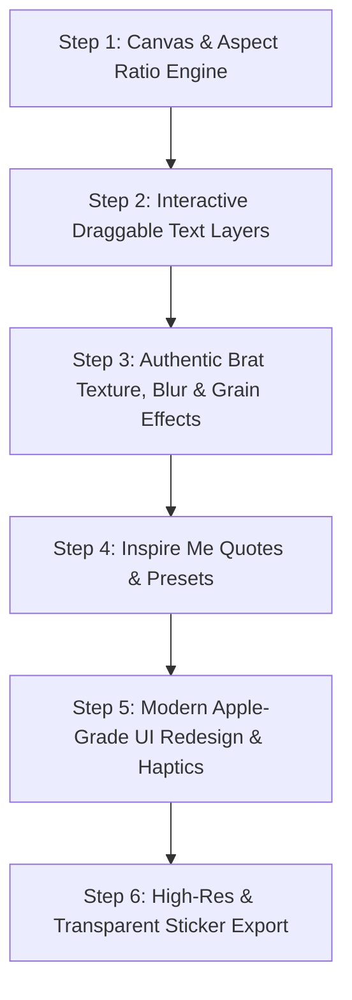

# 🚀 Bratify - Complete Redesign & Modern Features Roadmap

> **App Name:** `Bratify: Meme & Text Maker`  
> **Bundle ID:** `com.manav.bratify`  
> **App ID:** `6819142976`  
> **App Store URL:** `https://apps.apple.com/us/app/bratify-meme-text-maker/id6819142976`  
> **Monetization:** 100% Free • Ad-Free • Subscription-Free  

---

## 🎯 Executive Vision (Naya Bratify Kaisa Hoga?)

Current app sirf ek basic single-text green background generator hai. Aaj ke Gen-Z aur modern social media users (Instagram, TikTok, WhatsApp, X) ke liye hum is app ko ek **"Aesthetic Post & Viral Text Studio"** me transform karenge.

User sirf **10 seconds ke andar** aisi photo ya post bana sakega jo directly Instagram Story ya Feed par post karne layak lage, bina kisi watermark, ads, ya complex photo editors ke.

---

## 🌟 Best Features Ki Complete List (Module-by-Module)

### 📐 1. Multi-Aspect Ratio Canvas (Har Social Platform Ke Liye Ready)
Pehle app me sirf fixed canvas tha. Ab user ek tap me platform select kar sakega:
- **1:1 (Square):** Instagram Post, Threads, Profile Picture.
- **9:16 (Full Screen Story/Reel):** Instagram Stories, TikTok, WhatsApp Status, Snapchat.
- **4:5 (Portrait):** Instagram Feed (jo mobile screens par sabse zyada space leti hai).
- **16:9 (Landscape):** X (Twitter) Posts aur YouTube Thumbnails.

---

### 🎨 2. Authentic "Brat" & Retro Lo-Fi Effects (Signature Look)
Charli XCX ke *Brat* album cover ka signature look sirf green color nahi, balki uska **low-res, blurry, noisy texture** hai:
- **Noise / Film Grain Slider:** Post me authentic retro grainy texture add karne ke liye.
- **Gaussian Blur / Pixelate Slider:** Text aur background ko slight blurry ya authentic 2000s low-res vibe dene ke liye.
- **Invert / Contrast Toggle:** Ek tap me colors invert karna (Green on Black, Black on Green, White on Green).
- **Vignette Effect:** Corners par subtle dark gradient jo center text ko pop karta hai.

---

### ✍️ 3. Advanced Typography & Dual-Color Word Highlight
Aesthetic posts me text styling sabse important hoti hai:
- **Dual-Color Word Highlight:** User kisi ek specific lafz (word) ko highlight kar sake (jaise pura text Black ho aur ek word White ya Red ho).
- **Multi-Line Auto-Formatting:** Text automatically shrink/expand hoga canvas size ke hisaab se taake text kabhi canvas se bahar na kate.
- **Letter Spacing & Line Height Sliders:** Authentic typography customization.
- **Curated Font Library:**
  - *Brat Standard* (Iconic Arial Narrow / Low-res vibe)
  - *Y2K Cyberpunk* (Bold geometric grotesque)
  - *Retro 8-Bit / Pixel Font*
  - *Editorial Serif* (Clean magazine aesthetic)
  - *Streetwear Bold* (Heavy impactful headlines)

---

### 🖐️ 4. Multi-Layer Drag, Drop & Pinch-to-Zoom
- User canvas par multiple text boxes add kar sake (e.g., Main Title + Subtitle + Date/Credit stamp).
- Har text box ko **ungli se drag, rotate, aur pinch karke resize** karne ki sahulat.
- **Snap to Center / Magnetic Guides:** Jab text center me aaye to gentle haptic click feel ho.

---

### 🖼️ 5. Photo Remixing & Smart Backgrounds
- **Camera Roll Photo Import:** User apni selfie ya photo select karke uske upar bratty text likh sake.
- **Photo Tint & Opacity Slider:** User apni photo ko lime-green tint ya black & white filter dekar uske upar text daal sake.
- **Curated Color Themes & Gradients:**
  - *Classic Brat* (Acid Lime Green `#8ACE00`)
  - *Deluxe 360* (Pure Clean White `#FFFFFF`)
  - *Club Brat* (Dark Mode Carbon `#121212`)
  - *Pink Pop* (Hot Barbiecore Pink `#FF599C`)
  - *Metallic Silver* (Cyber Y2K Chrome gradient)

---

### 💡 6. "Inspire Me" / Trending Quotes Generator (Instant Memes)
Jab user ke paas koi idea na ho:
- **🎲 Randomize / Inspire Me Button:** Ek tap dabane par trending pop-culture quotes, aesthetic mood lines, aur funny bratty phrases auto-generate honge.
- Categories: *Mood, Confidence, Party/Club, Sarcastic, Aesthetic*.

---

### 💾 7. Pro Export & Direct Instagram Story Share
- **Ultra-HD PNG Export (3x Pixel Ratio):** Crystal clear output jo Instagram upload hone par blur ya pixelate nahi hoti.
- **Transparent PNG (Sticker Mode):** Background transparent karke export karna taake user isko WhatsApp ya iMessage me sticker ki tarah use kar sake.
- **One-Tap Direct Share:** Directly iOS Share Sheet trigger karna with Instagram, WhatsApp, X, Save to Photos options.

---

### ✨ 8. Sleek, Modern UI / UX Overhaul
- **Dark Minimalist Aesthetic:** Apple-style bottom-sheet controls, sleek icons, aur fluid animations.
- **Haptic Feedback:** Color change, format select, aur save button dabane par crisp tactile haptic feedback (`HapticFeedback.lightImpact()`).
- **Zero Clutter:** Screen par sirf canvas aur zaroori tools, taake user ka focus sirf post banane par ho.

---

## 📊 Purana App vs Naya Redesigned App (Comparison)

| Feature | Purana Brat Generator | Naya Bratify Studio |
| :--- | :--- | :--- |
| **Canvas Ratios** | Sirf 1:1 Square | 1:1, 9:16 (Story), 4:5 (Post), 16:9 |
| **Brat Blur/Grain Effect** | ❌ Nahi tha | ✅ Real-time Blur & Film Grain Sliders |
| **Text Layers** | Sirf 1 static text block | ✅ Multi-layer draggable & rotatable text |
| **Word Highlighting** | ❌ Pura text ek color ka | ✅ Dual-color text highlighting |
| **Quotes / Ideas** | ❌ Zero inspiration | ✅ 1-Tap "Inspire Me" Quote Generator |
| **Export Formats** | Basic photo save | ✅ Ultra-HD PNG + Transparent Sticker Mode |
| **UI Aesthetics** | Purana basic layout | ✅ Apple-grade sleek Dark UI with Haptics |
| **Performance** | 30 MB heavy images | ✅ Lightweight vector assets (<3 MB app size) |

---

## 🛠️ Step-by-Step Implementation Roadmap

### Phase 1: Interactive Canvas Engine
1. Canvas me aspect ratio toggle (1:1, 9:16, 4:5) add karna.
2. Background color palettes + photo blend overlay finalize karna.

### Phase 2: Draggable Multi-Text & Styling
1. Draggable/rotatable text widget integrate karna.
2. Fonts, letter-spacing, line-height, aur alignment live preview.

### Phase 3: Real-Time Grain & Aesthetic Effects
1. Blur filter aur texture overlay integrate karna.
2. 1-tap "Inspire Me" viral quotes database build karna.

### Phase 4: Sleek Dark UI & Export Polish
1. Bottom toolbar with clean icons (Aspect, Text, Effect, BG, Preset, Share).
2. Ultra HD export & Transparent sticker PNG export.
